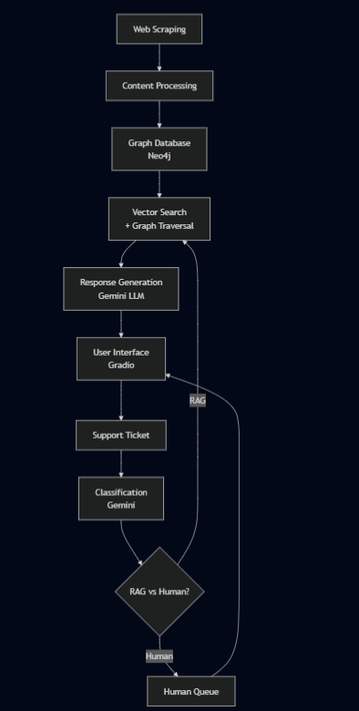

# Graph-RAG Customer Support Copilot

> **Intelligent Customer Support System Using Graph-Based Retrieval-Augmented Generation**

A sophisticated RAG system that leverages Neo4j's graph database capabilities to provide contextually-aware responses to customer support tickets. This system demonstrates the power of combining semantic search with graph relationships for superior information retrieval and response generation.


## 🚀 Quick Start

### Prerequisites
- **Python 3.13+**
- **Docker Desktop** (for Neo4j)
- **Google Gemini API Key** ([Get one here](https://makersuite.google.com/app/apikey))

### 1. Installation

```bash
# Clone repository
git clone https://github.com/bhuvanmdev/graph-rag-agent.git
cd graph-rag-agent

# Install dependencies
pip install -r requirements.txt
```

### 2. Setup Neo4j Database

**Windows:**
```bash
# Run the automated setup script
setup_neo4j_docker.bat
```

**Linux/macOS:**
```bash
# Manual Docker setup
docker run -d \
    --name neo4j-rag \
    -p 7474:7474 -p 7687:7687 \
    -e NEO4J_AUTH=neo4j/password \
    -e NEO4J_PLUGINS='["apoc"]' \
    -v ./neo4j_data:/data \ # get this data from my hf_space
    -v ./neo4j_logs:/logs \ # get this data from my hf_space
    neo4j:5.15
```

### 3. Configure Environment

Create a `.env` file:
```bash
GEMINI_API_KEY=your_gemini_api_key_here
NEO4J_URI=bolt://localhost:7687
NEO4J_USERNAME=neo4j
NEO4J_PASSWORD=password
```

### 4. Build Knowledge Base (One-time)

```bash
# Scrape and ingest website content into Neo4j
python ingest_pipeline.py --root-url https://website.com/ --max-pages 20
```

### 5. Launch Application

```bash
python rag_app.py
```

Access the interface at **http://localhost:7860**

---

## 🐳 Docker Deployment

### Build and Run with Docker

```bash
# Build the Docker image
docker build -t graph-rag-agent .

# Run the container with required environment variables
docker run -d \
    --name graph-rag-agent \
    -p 80:80 \
    -p 7474:7474 \
    -p 7687:7687 \
    -p 7860:7860 \
    -v ./neo4j_data:/app/neo4j_data \
    -v ./neo4j_logs:/app/neo4j_logs \
    -e GEMINI_API_KEY=your_gemini_api_key_here \
    -e NEO4J_URI=bolt://localhost:7687 \
    -e NEO4J_USERNAME=neo4j \
    -e NEO4J_PASSWORD=password \
    graph-rag-agent
```

### Docker Environment Variables

When running the application via Docker, you must provide the following environment variables:

| Variable | Required | Default | Description |
|----------|----------|---------|-------------|
| `GEMINI_API_KEY` | ✅ Yes | - | Your Google Gemini API key for AI responses |
| `NEO4J_URI` | ❌ No | `bolt://localhost:7687` | Neo4j database connection URI |
| `NEO4J_USERNAME` | ❌ No | `neo4j` | Neo4j database username |
| `NEO4J_PASSWORD` | ❌ No | `password` | Neo4j database password |

### Docker Volume Mounts

The Docker container expects these volumes to be mounted for data persistence:

- `./neo4j_data:/app/neo4j_data` - Neo4j database files
- `./neo4j_logs:/app/neo4j_logs` - Neo4j log files

# Note: <br>
The neo4j graph data for atlan website is available [here](https://huggingface.co/spaces/bhuvanmdev/chat-atlan/tree/main).

### Accessing Services

Once the container is running, access the services at:

- **Main Application**: http://localhost (Nginx reverse proxy)
- **Gradio Interface**: http://localhost:7860
- **Neo4j Browser**: http://localhost:7474
- **Neo4j Bolt**: localhost:7687

### Docker Commands

```bash
# View container logs
docker logs graph-rag-agent

# Stop the container
docker stop graph-rag-agent

# Remove the container
docker rm graph-rag-agent

# Rebuild and restart
docker build -t graph-rag-agent .
docker run -d --name graph-rag-agent -p 80:80 -p 7474:7474 -p 7687:7687 -p 7860:7860 \
    -v ./neo4j_data:/app/neo4j_data \
    -v ./neo4j_logs:/app/neo4j_logs \
    -e GEMINI_API_KEY=your_key_here \
    graph-rag-agent
```

---

## 🎯 Why This Project Matters

### The Problem with Traditional RAG Systems

Most RAG implementations use simple vector databases that treat documents as isolated chunks. This approach fails to capture the **interconnected nature of information** that exists in real-world knowledge bases.

### Our Graph-Based Solution

This project demonstrates a **superior architecture** that:

- **🔗 Preserves Relationships**: Documents link to each other, forming a rich knowledge graph
- **🧠 Contextual Understanding**: Retrieval considers both semantic similarity AND document relationships  
- **📊 Multi-hop Reasoning**: Can traverse connections to find comprehensive answers
- **🎯 Higher Accuracy**: Graph context dramatically improves response relevance

---

## 🏗️ System Architecture



## 🧪 Core Components

### 1. **Ingestion Pipeline** (`ingest_pipeline.py`)
**Runs once** to build your knowledge graph from web content.

**Key Features:**
- 🕷️ **Intelligent Web Scraping**: BFS crawling with retry logic and rate limiting
- 📄 **Content Processing**: HTML → Clean Markdown with metadata preservation  
- 🔪 **Smart Chunking**: Header-aware splitting that maintains document structure
- 🗄️ **Graph Storage**: Pages, chunks, and relationships stored in Neo4j
- 🧮 **Vector Embeddings**: 384-dimensional semantic embeddings for each chunk, ensures speed-quality balance.

**Usage:**
```bash
# Basic usage
python ingest_pipeline.py --root-url https://your-docs.com --max-pages 50

# Clear existing data and rebuild
python ingest_pipeline.py --root-url https://your-docs.com --max-pages 100 --clear-db
```

### 2. **RAG Application** (`rag_app.py`)
**Main application** providing the Gradio web interface for ticket processing.

**Features:**
- 📊 **Bulk Ticket Dashboard**: Process multiple tickets with analytics
- 🤖 **Interactive AI Agent**: Real-time ticket classification and response
- 🗄️ **Database Viewer**: Inspect stored data and system performance
- 📚 **Direct KB Query**: Raw access to the knowledge base

### 3. **Graph-Enhanced Retrieval** (`database.py` + `rag.py`)
**Core intelligence** combining vector search with graph relationships.

**Retrieval Strategy:**
```cypher
CALL db.index.vector.queryNodes('consumers', $top_k, $query_embedding) 
YIELD node, score
MATCH (p:Page)-[:HAS_CHUNK]->(node)
RETURN node.text AS content, 
       p.title AS page_title,
       node.source_url AS source,
       score
ORDER BY score DESC
```

**Generation Strategy:**
- ✅ **Structured Prompting**: JSON schema-enforced responses
- 🔗 **Context Integration**: Retrieved chunks with source attribution
- 🛡️ **Safety Filtering**: Content appropriateness validation
- 📊 **Quality Metrics**: Confidence scoring and relevance tracking

---

## 🧠 Why Neo4j Over Vector-Only Databases?

### The Graph Advantage

| **Aspect** | **Traditional Vector DB** | **Neo4j Graph + Vector** |
|------------|---------------------------|---------------------------|
| **Relationships** | ❌ Isolated chunks | ✅ Rich interconnections |
| **Context** | ❌ Limited to chunk content | ✅ Multi-document context |
| **Reasoning** | ❌ Single-hop only | ✅ Multi-hop traversals |
| **Scalability** | ⚠️ Limited by embedding space | ✅ Graph + vector scaling |
| **Query Flexibility** | ❌ Similarity only | ✅ Cypher + vector queries |
| **Enterprise Features** | ⚠️ Varies by vendor | ✅ ACID, clustering, security |

### Real-World Example

**Question**: *"How do I configure SSO with automatic user provisioning?"*

**Vector-Only Approach:**
- Finds chunks about "SSO configuration" 
- Finds separate chunks about "user provisioning"
- No understanding of their relationship

**Graph + Vector Approach:**
- Finds SSO configuration via semantic search
- Traverses `RELATES_TO` relationships to user management
- Discovers `REQUIRES` dependencies for complete setup
- Returns comprehensive, connected workflow

---

## 🎫 Intelligent Ticket Classification

### Classification Dimensions

Our AI classifier analyzes tickets across three dimensions:

**📋 Topics:**
- `How-to` - Usage instructions and tutorials
- `Product` - Feature questions and functionality  
- `Connector` - Data source integration issues
- `Lineage` - Data flow and dependency tracking
- `API/SDK` - Developer integration questions
- `SSO` - Single sign-on and authentication
- `Glossary` - Data catalog and terminology
- `Best practices` - Optimization and recommendations
- `Sensitive data` - Privacy and security concerns

**😊 Sentiment:**
- `Frustrated` - Urgent, blocked users
- `Curious` - Exploratory questions
- `Angry` - Escalated complaints  
- `Neutral` - Standard inquiries

**⚡ Priority:**
- `P0 (High)` - Business-critical, urgent
- `P1 (Medium)` - Important, time-sensitive
- `P2 (Low)` - Standard support requests

### Smart Routing Logic

```python
# RAG-Suitable Topics (Auto-answered)
RAG_TOPICS = ["How-to", "Product", "Best practices", "API/SDK", "SSO"]

# Human-Required Topics (Expert needed)  
HUMAN_TOPICS = ["Connector", "Lineage", "Glossary", "Sensitive data"]
```

---

## 📊 Interface Features

### 1. Bulk Classification Dashboard
Process sample tickets to see the complete pipeline:
- **Classification Results**: Topic, sentiment, priority analysis
- **Routing Decisions**: RAG vs human assignment logic
- **Response Generation**: Automated answers with source attribution
- **Performance Analytics**: Processing stats and quality metrics

### 2. Interactive AI Agent  
Submit new tickets for real-time processing:
- **Backend Analysis**: Internal classification and routing (developer view)
- **Frontend Response**: Customer-facing response (production view)
- **Source Attribution**: Documentation sources used for answers
- **Human Escalation**: One-click escalation to human agents

### 3. Database Management
Inspect and manage stored data:
- **System Statistics**: Knowledge base and ticket metrics
- **Ticket History**: All processed tickets with full context
- **Classification Audit**: AI decision logs and reasoning
- **Quality Tracking**: Response effectiveness and human feedback

### 4. Knowledge Base Query
Direct access to the RAG system:
- **Semantic Search**: Natural language queries
- **Source Discovery**: Find relevant documentation
- **Debug Information**: Retrieval statistics and relevance scores
- **Advanced Options**: Tune retrieval parameters

---

## ⚙️ Configuration & Customization

### Environment Configuration
```bash
# Core Configuration
GEMINI_API_KEY=your_api_key_here           # Required
NEO4J_URI=bolt://localhost:7687            # Default Neo4j
NEO4J_USERNAME=neo4j                       # Default user
NEO4J_PASSWORD=password                    # Default password
```

### Ingestion Parameters
```bash
# Customize data collection
python ingest_pipeline.py \
    --root-url https://your-knowledge-base.com \
    --max-pages 200 \                      # Pages to scrape
    --clear-db                             # Reset existing data
```

### Model Tuning
```python
# Embedding Model Options (in database.py)
'all-MiniLM-L6-v2'     # Default: Fast, 384 dimensions
'all-mpnet-base-v2'    # Higher quality: 768 dimensions  
'all-distilroberta-v1' # Balanced: 768 dimensions

# Chunk Configuration (in ingest_pipeline.py)
MarkdownHeaderTextSplitter  # Header-aware chunking (default)

# if markdown fails, the next one used is:
RecursiveCharacterTextSplitter(
    chunk_size=self.min_chunk_size,       # Optimal for context window
    chunk_overlap=50,      # Maintain continuity
)

# Retrieval Parameters (in interface.py)
top_k=5                    # Number of chunks to retrieve
```

---

## 🔧 Advanced Usage

### Programmatic API Access

```python
from database import Neo4jRetriever
from rag import GeminiRAG

# Initialize system
retriever = Neo4jRetriever()
rag = GeminiRAG(retriever)

# Process queries
result = rag.answer_query("How do I set up SAML SSO?", top_k=5)

print(f"Answer: {result.answer}")
print(f"Sources: {', '.join(result.sources)}")
print(f"Confidence: {result.chunks_used} chunks used")
print(f"Relevance: {max(result.relevance_scores):.3f}")
```

### Custom Graph Queries

```python
# Access graph relationships directly
with retriever.driver.session() as session:
    # Find related pages
    result = session.run("""
        MATCH (p:Page)-[:LINKS_TO]->(related:Page)
        WHERE p.url CONTAINS $topic
        RETURN related.title, related.url, 
               size((related)-[:HAS_CHUNK]->()) as chunk_count
        ORDER BY chunk_count DESC
    """, topic="authentication")
    
    for record in result:
        print(f"{record['title']}: {record['chunk_count']} chunks")
```

### Batch Processing

```python
# Process multiple tickets
tickets = [
    {"subject": "SSO setup help", "body": "Need guidance..."},
    {"subject": "API authentication", "body": "How do I..."},
]

for ticket in tickets:
    result = rag.answer_query(f"{ticket['subject']} {ticket['body']}")
    print(f"Ticket: {ticket['subject']}")
    print(f"Answer: {result.answer[:100]}...")
    print("---")
```

---


### Scaling Considerations
- **Vector Index**: Handles millions of chunks efficiently
- **Graph Queries**: Cypher optimization for complex traversals
- **Response Caching**: Cache frequent queries for speed
- **Horizontal Scaling**: Neo4j clustering for enterprise deployment

---


### Adding Features

**New Data Sources:**
1. Extend `ingest_pipeline.py` with new scrapers
2. Add relationship types in graph schema
3. Update retrieval queries for new content types

**New Classification Topics:**
1. Update `models.py` TopicEnum
2. Modify classification prompts in `classifier.py`
3. Adjust routing logic for new categories

**Custom Response Templates:**
1. Modify prompts in `rag.py`
2. Add domain-specific response patterns
3. Update validation schemas

---

## 📚 Additional Resources

### Sample Data
The system includes 30 realistic customer support tickets covering:
- Technical integration questions
- Product functionality inquiries  
- Authentication and security concerns
- Data governance and compliance
- API and SDK usage examples

### API Documentation
- **Neo4j Cypher**: [Graph query language guide](https://neo4j.com/docs/cypher-manual/current/)
- **Gemini API**: [Google AI integration docs](https://ai.google.dev/docs)
- **Gradio**: [Web interface framework](https://gradio.app/docs/)

### Best Practices
- **Graph Design**: Model relationships for optimal traversal
- **Chunk Strategy**: Balance size vs. context preservation
- **Prompt Engineering**: Optimize for consistent, accurate responses
- **Monitoring**: Track quality metrics and user feedback

---

## 📄 License

This project is licensed under the **MIT License** - see the [LICENSE](LICENSE) file for details.

---

## 🎯 Project Impact

This implementation demonstrates several **cutting-edge concepts** in modern AI systems:

- **🌐 Graph-Enhanced RAG**: Superior to traditional vector-only approaches
- **🤖 Intelligent Routing**: AI-driven decision making for optimal user experience  
- **📊 Production-Ready**: Complete system with monitoring, analytics, and quality controls
- **🔧 Extensible Architecture**: Modular design for easy customization and scaling
- **🎛️ Interactive Demo**: Full-featured web interface showcasing capabilities

Perfect for teams looking to build **next-generation RAG systems** that go beyond simple vector similarity to provide truly intelligent, context-aware responses.

---

**Built with ❤️ for the future of intelligent customer support appliactions**

*Questions? Create an issue or reach out to the maintainers!*